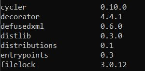
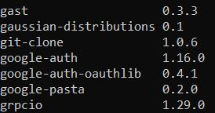

# OOP-Udacity
Object-oriented programming exercise from Udacity

## Contents
* Object-oriented programming exercises
* Distributions packages 

## Repository Structures
``` bash
.
|- OOP_exercises
|- packages
	|- gaussian_distribution_package (gaussian distribution only)
	|- distributions_package (gaussian distribution and binomial distribution)
|- test_venv
```

## Installation
1. Clone this repository
2. Install python3 and pip

## How to use distribution package
1. Setup a virtual environment and activate it. A virtual environment **test_venv** has already set up in this repo.
``` bash
cd test_venv/Scripts
activate
```

2. Select package that you wish to install 
```bash
cd ../../packages/[package]
```

3. Pip install the package. Can use pip list to check whether the package has downloaded successfully.
```bash
pip install .
pip list
```



4. Open python environment and import the package
``` bash
> python
>>> from distributions import Gaussian
>>> from distributions import Binomial
```

